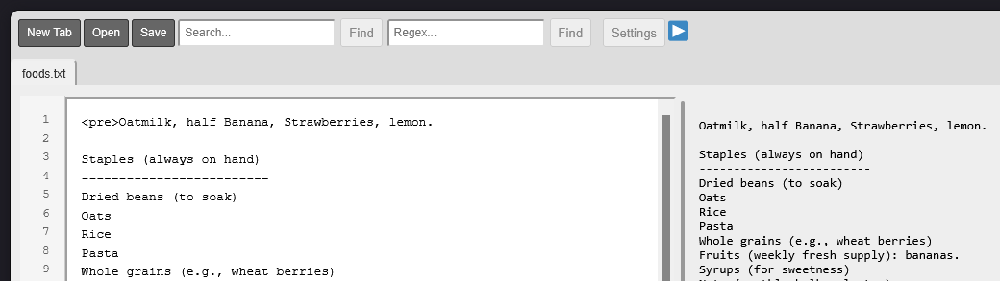

# FCE

```
 ____         ____   ____  _____ __  ___
|      /\    |    | |    |   |    |   /
|___  /  \   |____| |____|   |    |__/
|    /    \  |    | |\_      |    |  \
|   /      \_|____|_|  \__ __|__  |   \__
C ~ O ~ D ~ E       E ~ D ~ I ~ T ~ O ~ R                       
``` 



FCE: Fabrik Code Editor (a code editor for all coding languages)

A minimal html/javascript style code editor, works everywhere, with every language.

### Features

- Open code files
- Saving of code files
- Regular string search
- Regular expression search.
- Linenumbers
- Settings
- Preview screen for html/css (play button)

There is no code highlighting, and this is intended. There will be none.


